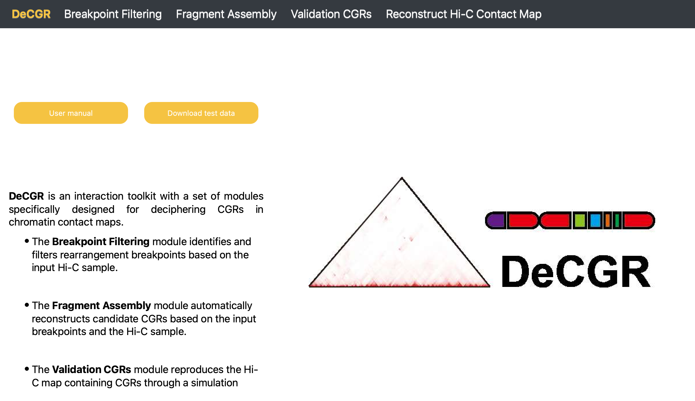
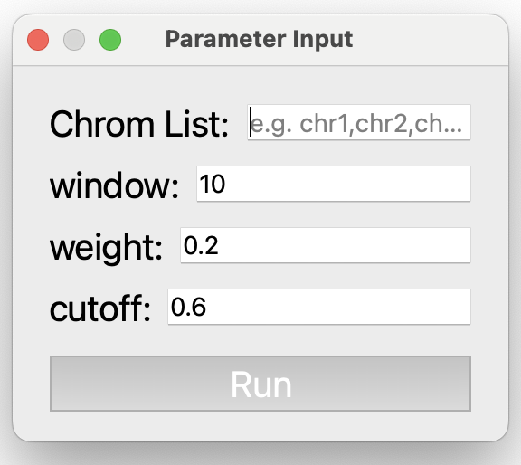
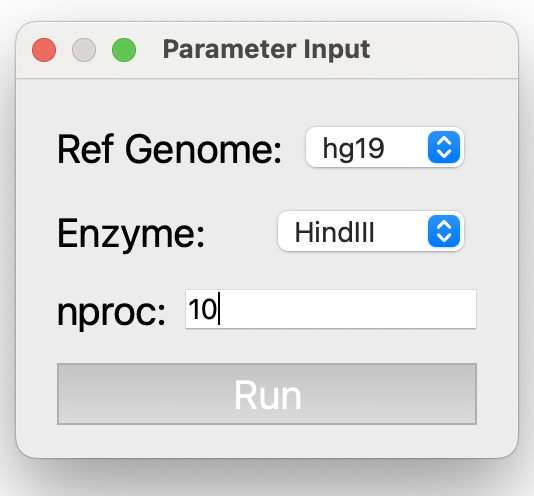
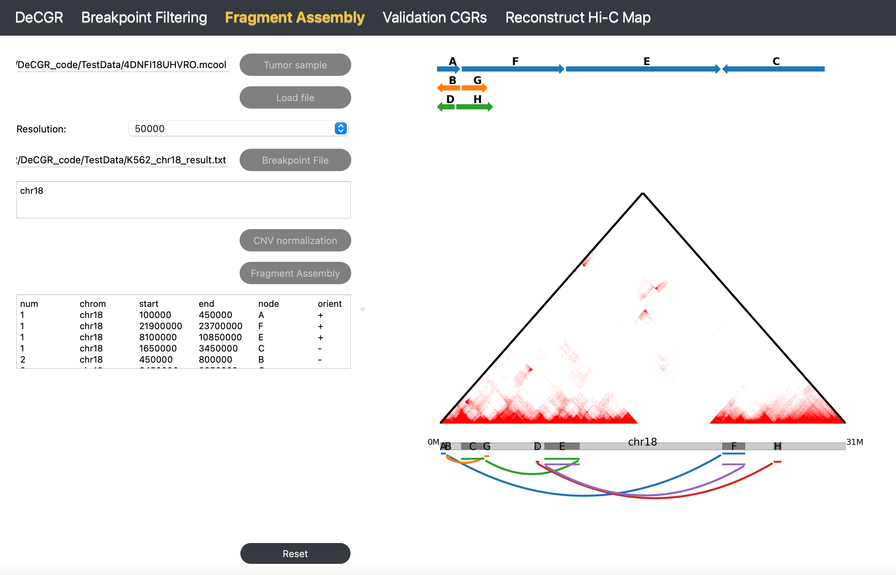
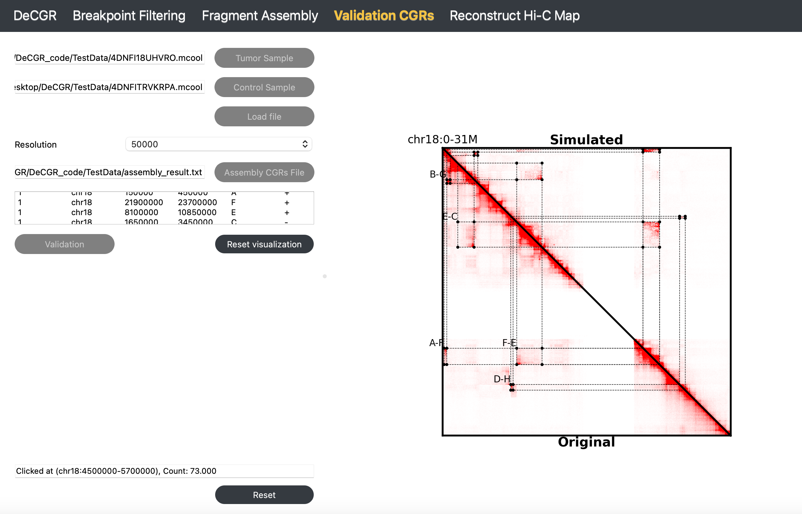
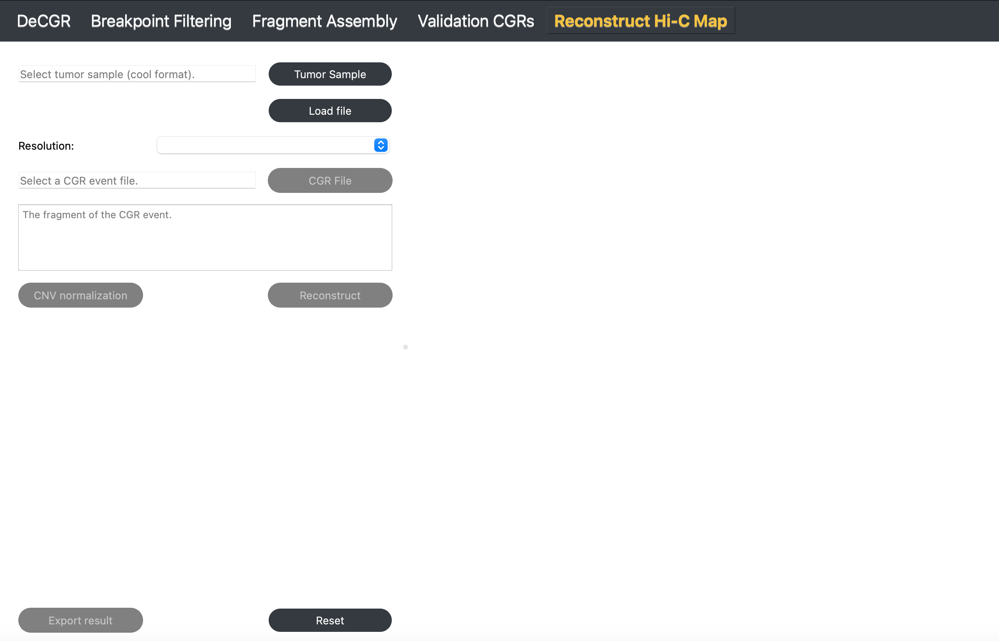
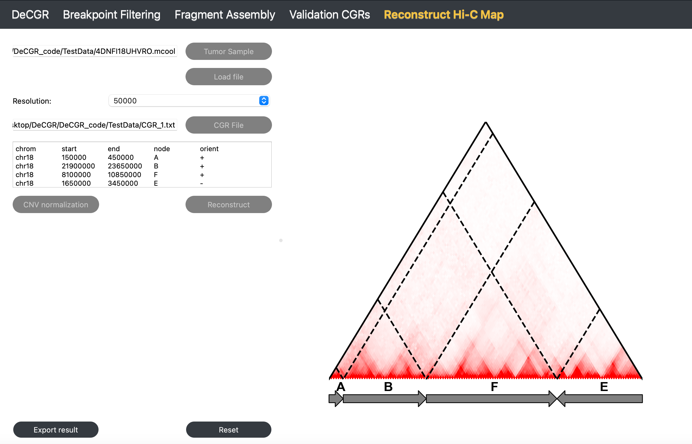

# DeCGR

**DeCGR, an interactive tool for deciphering complex genomic rearrangements from chromatin contact maps.**



## Introduction

DeCGR is organized into modules, with each module dedicated to a specific task, including:

- Breakpoint Filtering (Identification and filtering of simple rearrangement events).
- Fragment Assembly (Assembly of complex rearrangement events).
- Validation CGRs (Validation of the completeness and accuracy of complex rearrangement events).
- Reconstruct Hi-C Map (Generate a reconstructed Hi-C map based on a rearrangement event).

## Contents

- [Installation](#installation)
- [Test data](#test-data)
- [Breakpoint Filtering](#breakpoint-filtering)
- [Fragment Assembly](#fragment-assembly)
- [Validation CGRs](#validation-cgrs)
- [Reconstruct Hi-C Map](#reconstruct-hi-c-map)

## Getting Help

For questions, suggestions, or to report bugs, please create an issue. 

# Installation

## Required Packages
The following software must be installed on your machine:
python (required 3.7+ and tested with version 3.9)
### Python dependencies
* matplotlib (tested 3.9.2)
* numpy (tested 1.26.4)
* pandas (tested 2.2.3)
* PyQt5 (tested 5.15.11) 
* scikit-learn (tested 1.5.2)
* cooler (tested 0.10.2)
* sortedcontainers (tested 2.4.0)
* pomegranate (tested 0.15.0)
* scikit-image (tested 0.24.0)
* wget (tested 3.2)

### Installation
DeCGR and all the dependencies can be installed using pip:
   ```text
   $ conda config --add channels r
   $ conda config --add channels defaults
   $ conda config --add channels bioconda
   $ conda config --add channels conda-forge
   $ conda create -n DeCGR python=3.9 rpy2 r-mgcv
   $ conda activate DeCGR
   $ pip install -U DeCGR
   ```
# Running
Use the command below to access the DeCGR interface:  
## Mac os or Linux (Suggestion)
```text
   $ DeCGR
```
## Windows
```text
   $ DeCGR_windows
```
### Note
On Windows systems, packages like rpy2 may not be fully compatible, leading to various issues during installation. Below, we outline the problems and their solutions encountered during the installation process for user reference:

1. **Installation Error**: "error: Microsoft Visual C++ 14.0 or greater is required."
   
   **Solution**: Refer to this [guide](https://stackoverflow.com/questions/64261546/how-to-solve-error-microsoft-visual-c-14-0-or-greater-is-required-when-inst).  

2. **JIT Initialization Error**: "fatal error unable to initialize the jit" when executing **DeCGR_windows**.
   
   **Solution**:
   ```text
   $ set R_HOME=%CONDA_PREFIX%\Lib\R
   ```
3. **Missing 'stats' Package**: Error "package 'stats' in options('defaultPackages') was not found" when running the Fragment Assembly or visualization modules.
   
   **Solution**:
   ```text
   $ set ENV_PATH=%CONDA_PREFIX%
   $ xcopy “%ENV_PATH%\Lib\R\bin\x64*.*” “%ENV_PATH%\Lib\R\library\stats\libs\x64" /S /I
   ```

# Test Data
**Tumor Hi-C data**: K562 cell line (4DNFI18UHVRO.mcool) can be downloaded from [4dnucleome](https://data.4dnucleome.org/files-processed/4DNFI18UHVRO/).  
**Control Hi-C data**: GM12878 cell line (4DNFITRVKRPA.mcool) can be downloaded from [4dnucleome](https://data.4dnucleome.org/files-processed/4DNFITRVKRPA/).   
**Breakpoint file (for Module2)**: This file is named "K562_chr18_breakpoint.txt" and provided in the [DeCGR](https://github.com/GaoLabXDU/DeCGR/tree/main/TestData).  
**Assembly result file (for Module3)**: This file is named "K562_chr18_assembly_result.txt" and provided in the [DeCGR](https://github.com/GaoLabXDU/DeCGR/tree/main/TestData).  
**Complex rearrangement file (for Module4)**: This file is named "K562_chr18_CGR.txt" and provided in the [DeCGR](https://github.com/GaoLabXDU/DeCGR/tree/main/TestData).  

# Breakpoint Filtering

**The Breakpoint Filtering module identifies and filters breakpoints, providing the coordinates of simple rearrangement breakpoints.**


## Description

The Breakpoint Filtering module offers two key functionalities:

- Rearranged breakpoint identification with HiSV
- Visualization of rearrangement events

## Inputs

The input files for this module must include the following:

1. **A tumor Hi-C sample** in mcool or cool format.
   
2. **Candidate Rearrangement Events**:

   - **If not using HiSV**: Specify candidate rearrangement events with each breakpoint formatted as `chr1:0-50000`. These coordinates can be identical, representing a single base position (e.g., `chr1:50000-50000`).
     ## Tools for Identifying Rearrangement Breakpoints
     There are many methods available to identify rearrangement breakpoints, both from Hi-C data and other data sources such as whole-genome sequencing (WGS). Below are links to some useful tools:
      
      - [EagleC](https://github.com/XiaoTaoWang/EagleC) - Breakpoint detection based on Hi-C data.
      - [HiNT](https://github.com/parklab/HiNT) - A tool for identifying structural variants in Hi-C data.
      - [HiCtrans](https://github.com/ay-lab/HiCtrans) - Another method for detecting rearrangements using Hi-C data.
      - [hic_breakfinder](https://github.com/dixonlab/hic_breakfinder) - Software for breakpoint discovery in Hi-C data.
      - [LUMPY](https://github.com/arq5x/lumpy-sv) - A tool for detecting structural variants, compatible with WGS data.

      Each of these tools provides different capabilities for detecting rearrangement breakpoints based on your data type and research needs.

   - **If using HiSV**: Wait for HiSV to finish running to obtain the breakpoints for each simple rearrangement event from the **The result of HiSV** box.

## Guideline

### Step 1: Load Tumor Sample

Click **Tumor Sample**, select a tumor Hi-C file, and click **Load** to import the file.

### Step 2: Select Resolution

After loading the Hi-C file, use the **Resolution** dropdown to select the desired resolution.

### Step 3 (Optional): Identify Simple Rearrangement Breakpoints with HiSV

Click **Run HiSV** to identify breakpoints for simple rearrangements. In the popup window, specify parameters such as chromosomes to analyze, window size, weight, and cutoff. Click **Run** to run the process, which may take several minutes to complete. Once completed, the results will appear in **The result of HiSV** box.

#### Parameter Descriptions

For detailed information, see the [HiSV documentation](https://github.com/GaoLabXDU/HiSV):

- **Chrom List**: A list of chromosomes to analyze, specified as a comma-separated list without any spaces (e.g., `chr1,chr2,chr3`).
- **window**: The size of the sliding window used for analysis, specified as an integer (e.g., `10`).
- **weight**: A regularization parameter, specified as a float greater than 0 and less than 1 (e.g., `0.2`).
- **cutoff**: A threshold value for breakpoint selection, specified as a float greater than 0 and less than 1 (e.g., `0.6`).
<div align="center">
    
</div>

### Step 4: Enter Candidate Rearrangement Events

Enter the two breakpoints of candidate rearrangement events in the **Position1** and **Position2** fields.

### Step 5: Visualize Rearrangement Event

Click **Visualization** to display.


It provides an interactive visualization of identified rearrangements, allowing users to filter out false positives and zoom in on peaks in abnormal regions. By clicking specific peaks, users can pinpoint more accurate breakpoint positions, enhancing result reliability. 

# Fragment Assembly

**The Fragment Assembly module reconstructs candidate CGRs using the provided rearrangement breakpoints.**


## Inputs

The input files for this module must include the following:

1. **A tumor Hi-C sample** in mcool or cool format.
   
2. **A breakpoint file**, which contains multiple simple rearrangement events, is formatted as follows:

   ```text
   head K562_chr18_breakpoint.txt
   chr18       450000  chr18   21900000
   chr18       450000  chr18   3450000
   chr18       3450000 chr18   10850000
   chr18       7450000 chr18   25900000
   chr18       8100000 chr18   23700000
## Guideline

### Step 1: Load Tumor Sample

Click **Tumor Sample**, select the tumor Hi-C file, and click **Load** to import the file.

### Step 2: Select Resolution

Once the file is loaded, choose the desired resolution from the **Resolution** dropdown menu.

### Step 3: Load Breakpoint File

Click **Breakpoint File** to select a file containing simple rearrangement breakpoints.

### Step 4: CNV Normalization

Click **CNV Normalization**. In the popup window, select the reference genome and enzyme for the Hi-C sample. Adjust `nproc` according to the available computational resources. Click **Run** to run the process, which may take several minutes to complete. 

#### Parameter Descriptions

For detailed information, see the [NeoLoopFinder documentation](https://github.com/XiaoTaoWang/NeoLoopFinder):

- **Ref Genome**: The reference genome used for mapping the Hi-C data. Supported genomes include `hg38`, `hg19`, `mm10`, and `mm9`.
- **Enzyme**: The restriction enzyme used in the Hi-C experiment. Supported enzymes include `HindIII`, `MboI`, `DpnII`, `BglII`, `Arima`, and `uniform`. Use `uniform` if the genome was digested with a sequence-independent or uniformly cutting enzyme.
- **nproc**: The number of processing threads to use, specified as an integer (e.g., `10`).

<div align="center">
    
</div>

### Step 5: Run Fragment Assembly

Click **Fragment Assembly** to generate and view the assembled complex rearrangements. The results will be displayed on the right side of the interface as well as in **The result of assembled CGRs** box.

To reinitialize the module, click **Reset**.

## Output



The results interface presents slices of the Hi-C map corresponding to the rearrangement events, directional links between rearranged fragments, and schematic diagrams illustrating the assembled CGRs.

# Validation CGRs

**The Validation CGRs module allows users to verify the completeness and accuracy of the assembled CGRs.**


## Inputs

The input files for this module must include the following:

1. **A tumor Hi-C sample** in mcool or cool format.

2. **A normal Hi-C sample** in mcool or cool format.
   
3. **An assembled CGRs file**, which contains assembled CGR events, is formatted as follows:

   ```text
   head K562_chr18_assembly_result.txt
   num	chrom	start	end	node	orient
   1	chr18	150000	450000	A	+
   1	chr18	21900000	23700000	F	+
   1	chr18	8100000	10850000	E	+
   1	chr18	1650000	3450000	C	-
   2	chr18	450000	800000	B	-
   2	chr18	3450000	3850000	G	+
   3	chr18	7450000	7700000	D	-
   3	chr18	25900000	26500000	H	+
## Guideline

### Step 1: Load Tumor and Control Samples

Click **Tumor Sample** to select a tumor Hi-C file, then click **Control Sample** to select a normal Hi-C file. Click **Load** to import both files.

### Step 2: Select Resolution

Once both Hi-C files are loaded, use the **Resolution** dropdown menu to select the desired resolution.

### Step 3: Load Assembled CGRs File

Click **Assembly CGRs File** to select a file containing assembled CGR results.

### Step 4: Validate CGRs with Simulated Hi-C Map

Click **Validation** to generate a simulated Hi-C map. The results will display on the right, allowing you to visually compare abnormal interaction regions in the original and simulated Hi-C maps for validation.

### Step 5: Reset Visualization for New Validation

Click **Reset Visualization** to load a new assembled CGRs file for validation.

To reinitialize the module, click **Reset**.

## Output



The simulated Hi-C map is displayed alongside the original Hi-C map in heatmap format, with rearranged fragments highlighted by dashed lines. This view provides clear images for reviewing CGRs, enabling users to visually compare abnormal interaction regions in the original and simulated Hi-C maps for validation. If the abnormal regions do not align, users can adjust the rearranged fragments and input them again (To step3). CGR events are confirmed when the abnormal interaction regions match precisely.


# Reconstruct Hi-C Map

**The Reconstruct Hi-C Map module generates a reconstructed Hi-C map based on the identified CGR event.**



## Inputs

The input files for this module need to provide the following:

1. **A tumor Hi-C sample** in mcool or cool format.
   
2. **A CGR file**, which contains a CGR event, is formatted as follows:
   
   ```text
   head K562_chr18_CGR.txt
   chrom	start	end	node	orient
   chr18	150000	450000	A	+
   chr18	21900000	23650000	B	+
   chr18	8100000	10850000	F	+
   chr18	1650000	3450000	E	-

## Guideline

### Step 1: Load Tumor Sample

Click **Tumor Sample** to select a tumor Hi-C file, and then click **Load** to import the file.

### Step 2: Select Resolution

Once the Hi-C file is loaded, use the **Resolution** dropdown menu to choose the desired resolution.

### Step 3: Load CGR Event File

Click **CGR File** to select a file containing a CGR event.

### Step 4: CNV Normalization

Click **CNV Normalization**. In the popup window, select the reference genome and enzyme for the Hi-C sample, and adjust `nproc` based on available computational resources.  Click **Run** to run the process, which may take several minutes to complete. 

#### Parameter Descriptions

For detailed information, see [NeoLoopFinder](https://github.com/XiaoTaoWang/NeoLoopFinder):

- **Ref Genome**: The reference genome used for mapping the Hi-C data. Supported genomes include: `hg38`, `hg19`, `mm10`, and `mm9`.
- **Enzyme**: The restriction enzyme used in the Hi-C experiment. Supported enzymes include: `HindIII`, `MboI`, `DpnII`, `BglII`, `Arima`, and `uniform`. Use `uniform` if the genome was digested with a sequence-independent or uniformly cutting enzyme.
- **nproc**: The number of processing threads to use, specified as an integer (e.g., `10`).

<div align="center">
    
</div>

### Step 5: Reconstruct Hi-C Map

Click **Reconstruct** to generate a reconstructed Hi-C map.

### Step 6: Export Results

Click **Export Result** to export the reconstructed Hi-C contact matrix.

To reinitialize the module, click **Reset**.

## Output



The output presents the reconstructed Hi-C map, with dashed lines marking the boundaries of rearranged fragments.


