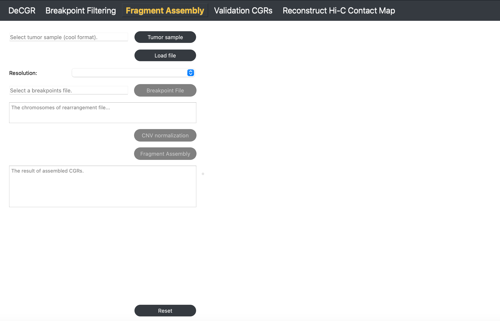

# DeCGR

**DeCGR, an interactive tool for deciphering complex genomic rearrangements from chromatin contact maps.**


## Introduction

DeCGR is organized into modules, with each module dedicated to a specific task, including:

- Breakpoint Filtering
- Fragment Assembly
- Validation CGRs
- Reconstruct Hi-C Map

## Contents

- [Installation](#installation)
- [Breakpoint Filtering](#breakpoint-filtering)
- [Fragment Assembly](#fragment-assembly)
- [Validation CGRs](#validation-cgrs)
- [Reconstruct Hi-C Map](#reconstruct-hi-c-map)

## Getting Help

For questions, suggestions, or to report bugs, please create an issue. 

# Breakpoint Filtering

**The Breakpoint Filtering module identifies and filters breakpoints, providing the coordinates of simple rearrangement breakpoints.**


## Description

The Breakpoint Filtering module offers two key functionalities:

- Rearranged breakpoint identification with HiSV
- Visualization of rearrangement events

## Inputs

The input files for this module must include the following:

1. **A tumor Hi-C sample** in mcool or cool format.
   
2. **Candidate Rearrangement Events**:

   - **If not using HiSV**: Specify candidate rearrangement events with each breakpoint formatted as `chr1:0-50000`. These coordinates can be identical, representing a single base position (e.g., `chr1:50000-50000`).

   - **If using HiSV**: Wait for HiSV to finish running to obtain the breakpoints for each simple rearrangement event from the **The result of HiSV** box.

## Guideline

### Step 1: Load Tumor Sample

Click **Tumor Sample**, select a tumor Hi-C file, and click **Load** to import the file.

### Step 2: Select Resolution

After loading the Hi-C file, use the **Resolution** dropdown to select the desired resolution.

### Step 3 (Optional): Identify Simple Rearrangement Breakpoints with HiSV

Click **Run HiSV** to identify breakpoints for simple rearrangements. In the popup window, specify parameters such as chromosomes to analyze, window size, weight, and cutoff. Once completed, the results will appear in **The result of HiSV** box.

#### Parameter Descriptions

For detailed information, see the [HiSV documentation](https://github.com/GaoLabXDU/HiSV):

- **Chrom List**: A list of chromosomes to analyze, specified as a comma-separated list without any spaces (e.g., `chr1,chr2,chr3`).
- **window**: The size of the sliding window used for analysis, specified as an integer (e.g., `10`).
- **weight**: A regularization parameter, specified as a float greater than 0 and less than 1 (e.g., `0.2`).
- **cutoff**: A threshold value for breakpoint selection, specified as a float greater than 0 and less than 1 (e.g., `0.6`).


### Step 4: Enter Candidate Rearrangement Events

Enter the two breakpoints of candidate rearrangement events in the **Position1** and **Position2** fields.

### Step 5: Visualize Rearrangement Event

Click **Visualization** to display

# Fragment Assembly

**The Fragment Assembly module reconstructs candidate CGRs using the provided rearrangement breakpoints.**



## Inputs

The input files for this module must include the following:

1. **A tumor Hi-C sample** in mcool or cool format.
   
2. **A breakpoint file**, which contains multiple simple rearrangement events, is formatted as follows:

   ```text
   head K562_chr18_breakpoint.txt
   chr18       450000  chr18   21900000
   chr18       450000  chr18   3450000
   chr18       3450000 chr18   10850000
   chr18       7450000 chr18   25900000
   chr18       8100000 chr18   23700000
## Guideline

### Step 1: Load Tumor Sample

Click **Tumor Sample**, select the tumor Hi-C file, and click **Load** to import the file.

### Step 2: Select Resolution

Once the file is loaded, choose the desired resolution from the **Resolution** dropdown menu.

### Step 3: Load Breakpoint File

Click **Breakpoint File** to select a file containing simple rearrangement breakpoints.

### Step 4: CNV Normalization

Click **CNV Normalization**. In the popup window, select the reference genome and enzyme for the Hi-C sample. Adjust `nproc` according to the available computational resources.

#### Parameter Descriptions

For detailed information, see the [NeoLoopFinder documentation](https://github.com/XiaoTaoWang/NeoLoopFinder):

- **Ref Genome**: The reference genome used for mapping the Hi-C data. Supported genomes include `hg38`, `hg19`, `mm10`, and `mm9`.
- **Enzyme**: The restriction enzyme used in the Hi-C experiment. Supported enzymes include `HindIII`, `MboI`, `DpnII`, `BglII`, `Arima`, and `uniform`. Use `uniform` if the genome was digested with a sequence-independent or uniformly cutting enzyme.
- **nproc**: The number of processing threads to use, specified as an integer (e.g., `10`).


### Step 5: Run Fragment Assembly

Click **Fragment Assembly** to generate and view the assembled complex rearrangements. The results will be displayed on the right side of the interface as well as in **The result of assembled CGRs** box.

To reinitialize the module, click **Reset**.

## Output


# Validation CGRs

**The Validation CGRs module allows users to verify the completeness and accuracy of the assembled CGRs.**


## Inputs

The input files for this module must include the following:

1. **A tumor Hi-C sample** in mcool or cool format.

2. **A normal Hi-C sample** in mcool or cool format.
   
3. **An assembled CGRs file**, which contains assembled CGR events, is formatted as follows:

   ```text
   head K562_chr18_assembly_result.txt
   num	chrom	start	end	node	orient
   1	chr18	150000	450000	A	+
   1	chr18	21900000	23700000	F	+
   1	chr18	8100000	10850000	E	+
   1	chr18	1650000	3450000	C	-
   2	chr18	450000	800000	B	-
   2	chr18	3450000	3850000	G	+
   3	chr18	7450000	7700000	D	-
   3	chr18	25900000	26500000	H	+
## Guideline

### Step 1: Load Tumor and Control Samples

Click **Tumor Sample** to select a tumor Hi-C file, then click **Control Sample** to select a normal Hi-C file. Click **Load** to import both files.

### Step 2: Select Resolution

Once both Hi-C files are loaded, use the **Resolution** dropdown menu to select the desired resolution.

### Step 3: Load Assembled CGRs File

Click **Assembly CGRs File** to select a file containing assembled CGR results.

### Step 4: Validate CGRs with Simulated Hi-C Map

Click **Validation** to generate a simulated Hi-C map. The results will display on the right, allowing you to visually compare abnormal interaction regions in the original and simulated Hi-C maps for validation.

### Step 5: Reset Visualization for New Validation

Click **Reset Visualization** to load a new assembled CGRs file for validation.

To reinitialize the module, click **Reset**.

## Output


# Reconstruct Hi-C Map

**The Reconstruct Hi-C Map module generates a reconstructed Hi-C map based on the identified CGR event.**


## Inputs

The input files for this module need to provide the following:

1. **A tumor Hi-C sample** in mcool or cool format.
   
2. **A CGR file**, which contains a CGR event, is formatted as follows:
   
   .. code-block:: text

       head K562_chr18_CGR.txt
       chrom	start	end	node	orient
       chr18	150000	450000	A	+
       chr18	21900000	23650000	B	+
       chr18	8100000	10850000	F	+
       chr18	1650000	3450000	E	-

## Guideline

### Step 1: Load Tumor Sample

Click **Tumor Sample** to select a tumor Hi-C file, and then click **Load** to import the file.

### Step 2: Select Resolution

Once the Hi-C file is loaded, use the **Resolution** dropdown menu to choose the desired resolution.

### Step 3: Load CGR Event File

Click **CGR File** to select a file containing a CGR event.

### Step 4: CNV Normalization

Click **CNV Normalization**. In the popup window, select the reference genome and enzyme for the Hi-C sample, and adjust `nproc` based on available computational resources.

#### Parameter Descriptions

For detailed information, see [NeoLoopFinder](https://github.com/XiaoTaoWang/NeoLoopFinder):

- **Ref Genome**: The reference genome used for mapping the Hi-C data. Supported genomes include: `hg38`, `hg19`, `mm10`, and `mm9`.
- **Enzyme**: The restriction enzyme used in the Hi-C experiment. Supported enzymes include: `HindIII`, `MboI`, `DpnII`, `BglII`, `Arima`, and `uniform`. Use `uniform` if the genome was digested with a sequence-independent or uniformly cutting enzyme.
- **nproc**: The number of processing threads to use, specified as an integer (e.g., `10`).


### Step 5: Reconstruct Hi-C Map

Click **Reconstruct** to generate a reconstructed Hi-C map.

### Step 6: Export Results

Click **Export Result** to export the reconstructed Hi-C contact matrix.

To reinitialize the module, click **Reset**.

## Output


