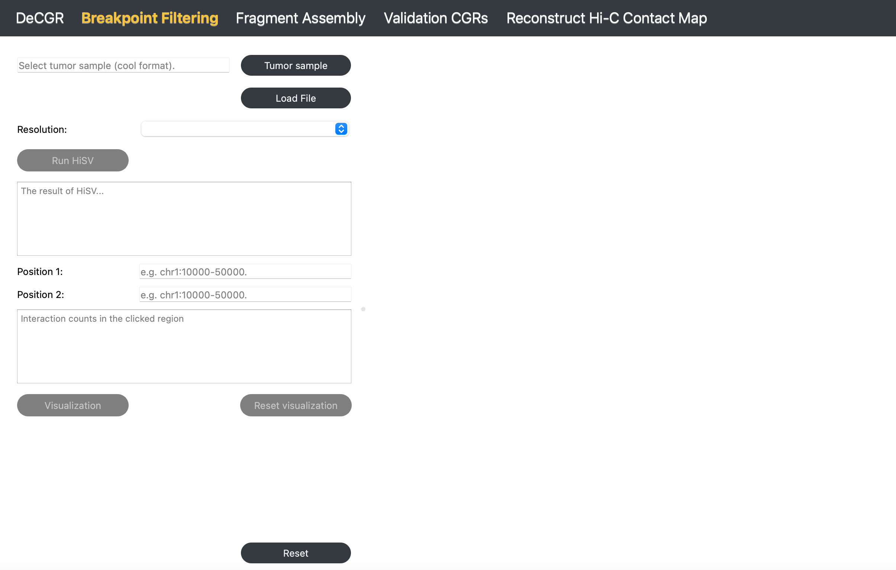
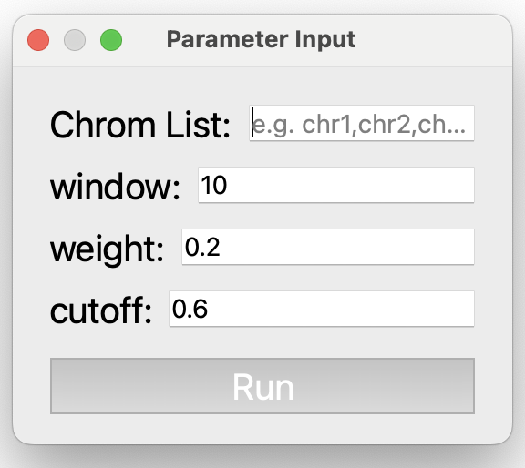
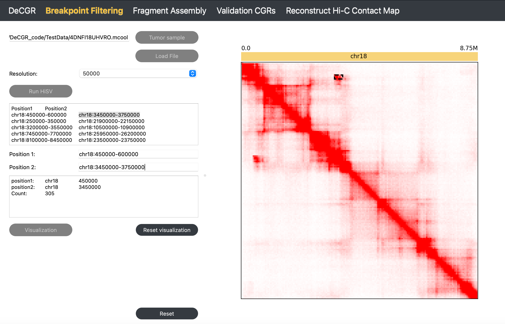

Breakpoint Filtering
====================

**The Breakpoint Filtering module identifies and filters breakpoints, providing the coordinates of simple rearrangement breakpoints.**

Description
-----------
The Breakpoint Filtering module offers two key functionalities:

    - Rearranged breakpoint identification with HiSV
    - Visualization of rearrangement events

Inputs
------

The input files for this module must include the following:

1. **A tumor Hi-C sample** in mcool or cool format.
   
2. **Candidate Rearrangement Events**:

   - **If not using HiSV**: Specify candidate rearrangement events with each breakpoint formatted as `chr1:0-50000`. These coordinates can be identical, representing a single base position (e.g., `chr1:50000-50000`).

   - **If using HiSV**: Wait for HiSV to finish running to obtain the breakpoints for each simple rearrangement event from the **The result of HiSV** box.

Guideline
---------

**Step 1**: Load Tumor Sample
~~~~~~~~~~~~~~~~~~~~~~~~~~~~~
Click :guilabel:`Tumor Sample`, select a tumor Hi-C file, and click :guilabel:`Load` to import the file.

**Step 2**: Select Resolution
~~~~~~~~~~~~~~~~~~~~~~~~~~~~~~
After loading the Hi-C file, use the Resolution dropdown to select the desired resolution.

**Step 3 (Optional)**: Identify Simple Rearrangement Breakpoints with HiSV
~~~~~~~~~~~~~~~~~~~~~~~~~~~~~~~~~~~~~~~~~~~~~~~~~~~~~~~~~~~~~~~~~~~~~~~~~~
Click :guilabel:`Run HiSV` to identify breakpoints for simple rearrangements. In the popup window, specify parameters such as chromosomes to analyze, window size, weight, and cutoff. Once completed, the results will appear in **The result of HiSV** box.

**Parameter Descriptions** (for detailed information, see `HiSV documentation <https://github.com/GaoLabXDU/HiSV>`_):
   
   - **Chrom List**: A list of chromosomes to analyze, specified as a comma-separated list, without any spaces (e.g., chr1,chr2,chr3).
   - **window**: The size of the sliding window used for analysis, specified as an integer (e.g., 10).
   - **weight**: A float representing the regularization parameter, specified as a float greater than 0 and less than 1. (e.g., 0.2).
   - **cutoff**: A threshold value for breakpoint selection, specified as a float greater than 0 and less than 1. (e.g., 0.6).

**Step 4**: Enter Candidate Rearrangement Events
~~~~~~~~~~~~~~~~~~~~~~~~~~~~~~~~~~~~~~~~~~~~~~~~
Enter the two breakpoints of candidate rearrangement events in the **Position1** and **Position2** fields.

**Step 5**: Visualize Rearrangement Event
~~~~~~~~~~~~~~~~~~~~~~~~~~~~~~~~~~~~~~~~~
Click :guilabel:`Visualization` to display the Hi-C map slice for the candidate rearrangement on the right side of the interface. Rearranged segments are highlighted: regions are outlined with a black box, and individual points are marked with a circle.

**Step 6**: Screen for False Positives or Refine Breakpoints
~~~~~~~~~~~~~~~~~~~~~~~~~~~~~~~~~~~~~~~~~~~~~~~~~~~~~~~~~~~~
Observe abnormal interactions to screen for false positives. Alternatively, select peaks within abnormal interaction regions to refine breakpoints.

**Step 7**: Reset Visualization
~~~~~~~~~~~~~~~~~~~~~~~~~~~~~~~
Click :guilabel:`Reset Visualization` to analyze a new rearrangement event (repeat **Step 4**).

To reinitialize the module, click :guilabel:`Reset`.

Output
------

