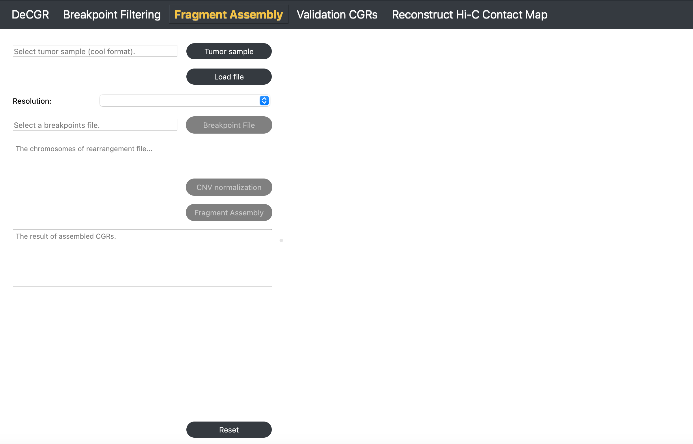
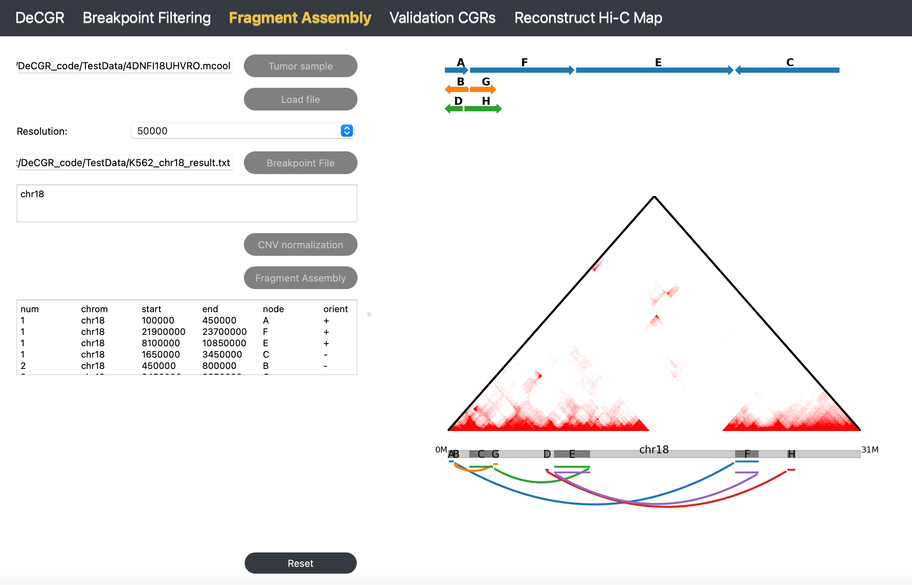

Fragment Assembly
=================

**The Fragment Assembly module reconstructs candidate CGRs using the provided rearrangement breakpoints.**

Inputs
------

The input files for this module must include the following:

1. **A tumor Hi-C sample** in mcool or cool format.
   
2. **A breakpoint file**, which contains multiple simple rearrangement events, is formatted as follows:

.. code-block:: text

   head K562_chr18_breakpoint.txt
   chr18       450000  chr18   21900000
   chr18       450000  chr18   3450000
   chr18       3450000 chr18   10850000
   chr18       7450000 chr18   25900000
   chr18       8100000 chr18   23700000

Guideline
---------

**Step 1**: Load Tumor Sample
~~~~~~~~~~~~~~~~~~~~~~~~~~~~~
Click :guilabel:`Tumor Sample`, select the tumor Hi-C file, and click :guilabel:`Load` to import the file.

**Step 2**: Select Resolution
~~~~~~~~~~~~~~~~~~~~~~~~~~~~~
Once the file is loaded, choose the desired resolution from the :guilabel:`Resolution` dropdown menu.

**Step 3**: Load Breakpoint File
~~~~~~~~~~~~~~~~~~~~~~~~~~~~~~~~
Click :guilabel:`Breakpoint File` to select a file containing simple rearrangement breakpoints.

**Step 4**: CNV normalization
~~~~~~~~~~~~~~~~~~~~~~~~~~~~~
Click :guilabel:`CNV Normalization`. In the popup window, select the reference genome and enzyme for the Hi-C sample. Adjust `nproc` according to the available computational.

**Parameter Descriptions** (for detailed information, see `NeoLoopFinder <https://github.com/XiaoTaoWang/NeoLoopFinder>`_):

   - **Ref Genome**: The reference genome used for mapping the Hi-C data. Supported genomes include: `hg38`, `hg19`, `mm10`, and `mm9`.
   - **Enzyme**: The restriction enzyme used in the Hi-C experiment. Supported enzymes include: `HindIII`, `MboI`, `DpnII`, `BglII`, `Arima`, and `uniform`. Use `uniform` if the genome was digested with a sequence-independent or uniformly cutting enzyme.
   - **nproc**: The number of processing threads to use, specified as an integer (e.g., `10`).

.. image:: image/CNV_normal_param.png
   :alt: “CNV_normalization_parameter_setting”
   :width: 300px
   :align: center

**Step 5**: Run Fragment Assembly
~~~~~~~~~~~~~~~~~~~~~~~~~~~~~~~~~
Click :guilabel:`Fragment Assembly` to generate and view the assembled complex rearrangements. The results will be displayed on the right side of the interface as well as in the **The result of assembled CGRs** box.

To reinitialize the module, click :guilabel:`Reset`.

Output
------
