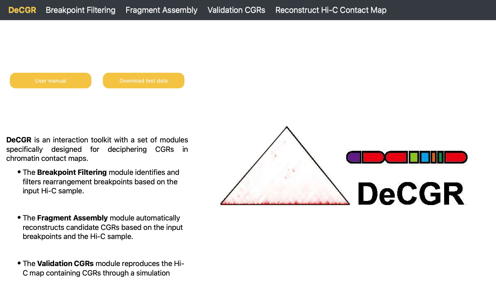

.. DeCGR documentation master file, created by
   sphinx-quickstart on Sun Oct 27 20:42:27 2024.
   You can adapt this file completely to your liking, but it should at least
   contain the root `toctree` directive.

DeCGR
=====

**DeCGR, an interactive tool for deciphering complex genomic rearrangements from chromatin contact maps.**

Introduction
------------

DeCGR is organized into modules, with each module dedicated to a specific task, including:

    - Breakpoint Filtering
    - Fragment Assembly
    - Validation CGRs
    - Reconstruct Hi-C Map

.. toctree::
   :maxdepth: 2
   :caption: Contents

   installation
   breakpoint_filtering
   fragment_assembly
   validation_CGRs
   reconstruct_map

Getting Help
------------
For all kinds of questions, suggestions for changes/enhancements, and to report bugs, please create an issue on our `GitHub repository <https://github.com/GaoLabXDU/DeCGR>`_.