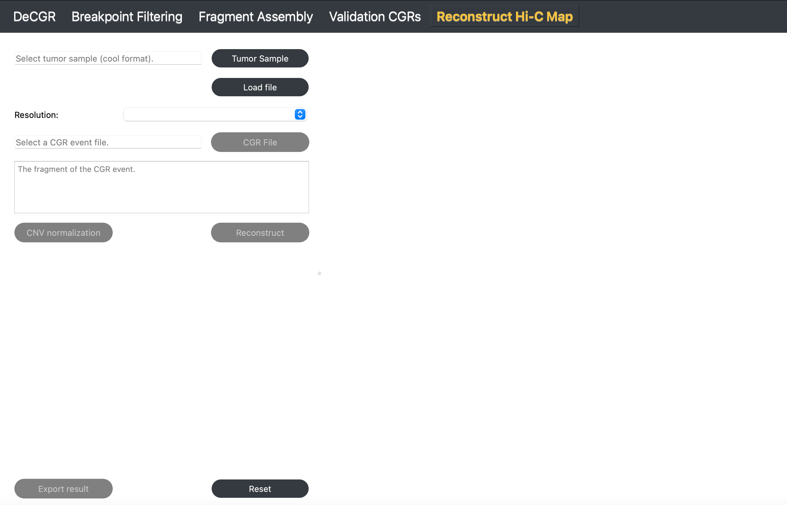
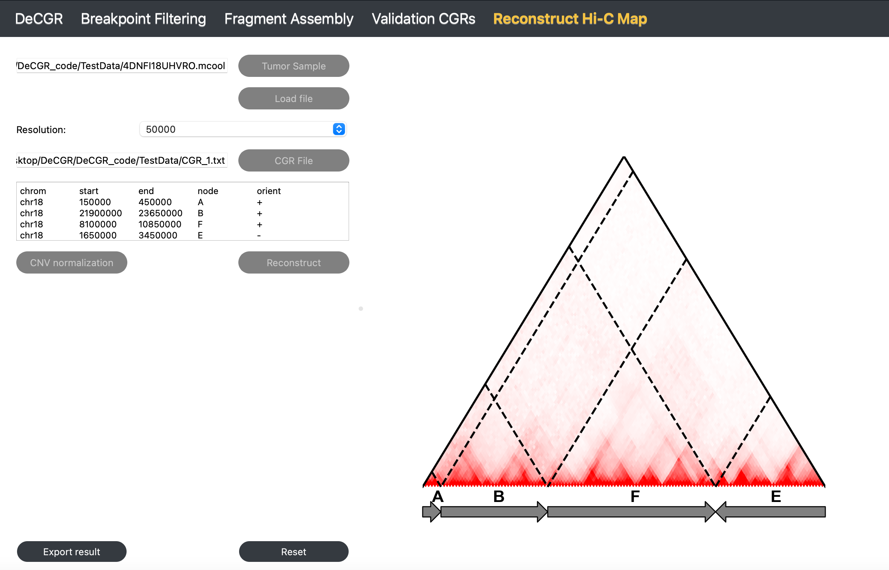

Reconstruct Hi-C Map
====================

**The Reconstruct Hi-C Map module generate a reconstructed Hi-C map based on the identified CGR event.**

Inputs
------

The input files for this module need to provide the following:

1. **A tumor Hi-C sample** in mcool or cool format.
   
2. **A CGR file**, which contains a CGR event, is formatted as follows:
   
.. code-block:: text

    haed K562_chr18_CGR.txt
    chrom	start	end	node	orient
    chr18	150000	450000	A	+
    chr18	21900000	23650000	B	+
    chr18	8100000	10850000	F	+
    chr18	1650000	3450000	E	-

Guideline
---------

**Step 1**: Load Tumor Sample
~~~~~~~~~~~~~~~~~~~~~~~~~~~~~
Click :guilabel:`Tumor Sample` to select a tumor Hi-C file, and then click :guilabel:`Load` to import the file.

**Step 2**: Select Resolution
~~~~~~~~~~~~~~~~~~~~~~~~~~~~~
Once the Hi-C file is loaded, use the :guilabel:`Resolution` dropdown menu to choose the desired resolution.

**Step 3**: Load CGR Event File
~~~~~~~~~~~~~~~~~~~~~~~~~~~~~~~
Click :guilabel:`CGR File` to select a file containing a CGR event.

**Step 4**: CNV normalization (To better visualization)
~~~~~~~~~~~~~~~~~~~~~~~~~~~~~
Click :guilabel:`CNV Normalization`. In the popup window, select the reference genome and enzyme for the Hi-C sample, and adjust `nproc` based on available computational resources.

**Parameter Descriptions** (for detailed information, see `NeoLoopFinder <https://github.com/XiaoTaoWang/NeoLoopFinder>`_):

   - **Ref Genome**: The reference genome used for mapping the Hi-C data. Supported genomes include: `hg38`, `hg19`, `mm10`, and `mm9`.
   - **Enzyme**: The restriction enzyme used in the Hi-C experiment. Supported enzymes include: `HindIII`, `MboI`, `DpnII`, `BglII`, `Arima`, and `uniform`. Use `uniform` if the genome was digested with a sequence-independent or uniformly cutting enzyme.
   - **nproc**: The number of processing threads to use, specified as an integer (e.g., `10`).

.. image:: image/CNV_normal_param.png
   :alt: “CNV_normalization_parameter_setting”
   :width: 300px
   :align: center

**Step 5**: Reconstruct Hi-C Map
~~~~~~~~~~~~~~~~~~~~~~~~~~~~~~~~
Click :guilabel:`Reconstruct` to generate a reconstructed Hi-C map.

**Step 6**: Export Results
~~~~~~~~~~~~~~~~~~~~~~~~~~
Click :guilabel:`Export Result` to export the reconstructed Hi-C contact matrix.

To reinitialize the module, click :guilabel:`Reset`.

Output
------

