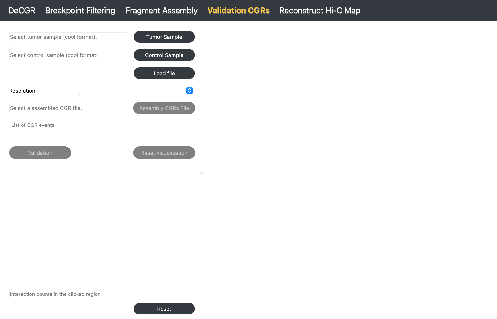

Validation CGRs
===============

**The Validation CGRs module allows users to verify the completeness and accuracy of the assembled CGRs.**

Inputs
------

The input files for this module must include the following:

1. **A tumor Hi-C sample** in mcool or cool format.

2. **A normal Hi-C sample** in mcool or cool format.
   
3. **A assembled CGRs file**, which contains assembled CGRs events, is formatted as follows:
   
.. code-block:: text

    haed K562_chr18_assembly_result.txt
    num	chrom	start	end	node	orient
    1	chr18	150000	450000	A	+
    1	chr18	21900000	23700000	F	+
    1	chr18	8100000	10850000	E	+
    1	chr18	1650000	3450000	C	-
    2	chr18	450000	800000	B	-
    2	chr18	3450000	3850000	G	+
    3	chr18	7450000	7700000	D	-
    3	chr18	25900000	26500000	H	+

Guideline
---------

**Step 1**: Load Tumor and Control Samples
~~~~~~~~~~~~~~~~~~~~~~~~~~~~~~~~~~~~~~~~~~
Click :guilabel:`Tumor Sample` to select a tumor Hi-C file, then click :guilabel:`Control Sample` to select a normal Hi-C file. Click :guilabel:`Load` to import both files.

**Step 2**: Select Resolution
~~~~~~~~~~~~~~~~~~~~~~~~~~~~~
Once both Hi-C files are loaded, use the :guilabel:`Resolution` dropdown menu to select the desired resolution.

**Step 3**: Load Assembled CGRs File
~~~~~~~~~~~~~~~~~~~~~~~~~~~~~~~~~~~~
Click :guilabel:`Assembly CGRs File` to select a file containing assembled CGRs results.

**Step 4**: Validate CGRs with Simulated Hi-C Map
~~~~~~~~~~~~~~~~~~~~~~~~~~~~~~~~~~~~~~~~~~~~~~~~~
Click :guilabel:`Validation` to generate a simulated Hi-C map. The results will display on the right, allowing you to visually compare abnormal interaction regions in the original and simulated Hi-C maps for validation.

**Step 5**: Reset Visualization for New Validation
~~~~~~~~~~~~~~~~~~~~~~~~~~~~~~~~~~~~~~~~~~~~~~~~~~
Click :guilabel:`Reset Visualization` to load a new assembled CGRs file for validation.

To reinitialize the module, click :guilabel:`Reset`.

Output
------

.. image:: image/module3_output.png
   :alt: “Module4”
   :width: 700px
   :align: center